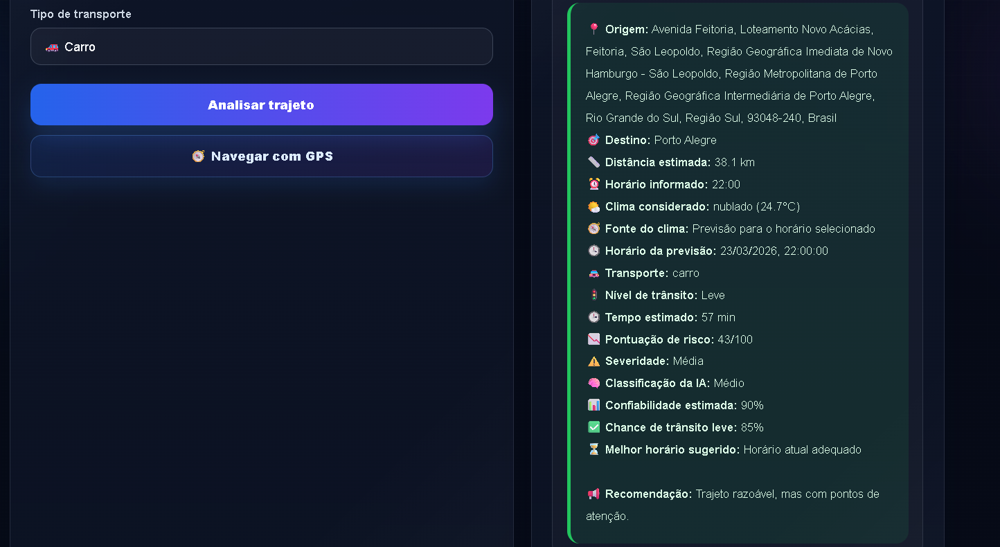
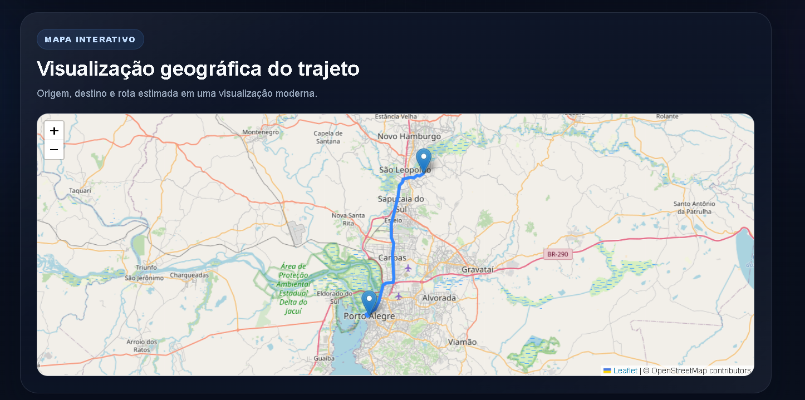

<<p align="center">
  
</p>

<h1 align="center">ViaLivre AI</h1>

<p align="center">
Mobilidade inteligente com análise preditiva de trânsito, clima e rotas em tempo real.
</p>

<p align="center">
Planeje seu deslocamento com mais segurança, previsibilidade e eficiência utilizando inteligência artificial.
</p>

---

# Sobre o projeto

O **ViaLivre AI** é uma aplicação que simula cenários de mobilidade urbana utilizando dados de rota, clima e modal de transporte para calcular risco de atraso e recomendar o melhor momento para sair.

A proposta do projeto é demonstrar como tecnologia pode ser utilizada para melhorar decisões do dia a dia, combinando:

- análise de trajeto
- previsão climática
- comparação de modais
- cálculo de risco
- visualização geográfica
- recomendações inteligentes

---

# Funcionalidades

- cálculo de risco de atraso com base em múltiplos fatores
- comparação entre diferentes meios de transporte
- sugestão do melhor horário para sair
- visualização da rota no mapa
- geolocalização automática
- simulação de cenários
- dashboard com histórico de análises
- interface moderna estilo SaaS

---

# Tecnologias utilizadas

### Frontend
- HTML5
- CSS3
- JavaScript
- Leaflet (mapas interativos)

### Backend
- Node.js
- Express
- SQLite

### APIs e recursos
- Geolocalização do navegador
- OpenStreetMap
- lógica de simulação de mobilidade

---
## 🖼️ Preview da aplicação

### Página inicial


---

### Dashboard inteligente


---

### Resultado da análise inteligente



---

### Visualização da rota no mapa



---

### Comparação inteligente de horários


---


# Arquitetura do projeto


## 🏗️ Arquitetura

vialivre-ai
│
├── src
│ └── backend
│ ├── controllers
│ ├── routes
│ ├── services
│ ├── config
│ ├── data
│ ├── database
│ ├── server.js
│ │
│ └── frontend
│ ├── index.html
│ ├── style.css
│ └── script.js
│
├── package.json
└── README.md


---

## 🧩 Tecnologias

### Backend
- Node.js
- Express
- SQLite
- arquitetura em camadas

### Frontend
- HTML5
- CSS moderno
- JavaScript
- Chart.js
- Leaflet.js

### APIs externas
- OpenStreetMap
- OSRM Routing API
- Open-Meteo Weather API
- Geolocation API

---

## 🚀 Executar localmente

### clonar repositório

```bash
git clone https://github.com/RobersonCodes/vialivre-ai.git
cd vialivre-ai

instalar dependências
npm install
iniciar servidor
npm run dev
acessar aplicação
http://localhost:3000
📊 Exemplo de análise

Entrada:

origem: São Leopoldo
destino: Novo Hamburgo
horário: 11:00
transporte: carro
clima: parcialmente nublado

Saída:

tempo estimado: 7 minutos
risco de atraso: baixo
nível de trânsito: leve
recomendação: horário adequado

🎯 Objetivo

Demonstrar habilidades em:

desenvolvimento full stack
criação de APIs REST
arquitetura de software
integração com APIs externas
manipulação de mapas
geolocalização em aplicações web
lógica de previsão de risco
organização de código profissional
📌 Roadmap
autenticação de usuário
salvar casa e trabalho
dashboard em React
versão mobile PWA
deploy em nuvem
banco de dados PostgreSQL
previsão de trânsito em tempo real
machine learning avançado
👨‍💻 Autor

Roberson de Oliveira

Projeto desenvolvido para portfólio profissional na área de tecnologia.

⭐ Apoie o projeto

Se este projeto te ajudou, deixe uma estrela no repositório.